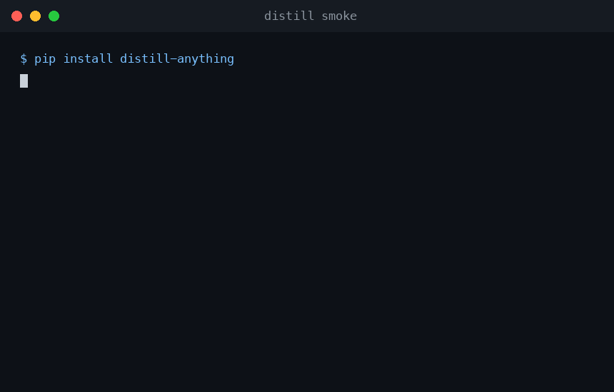
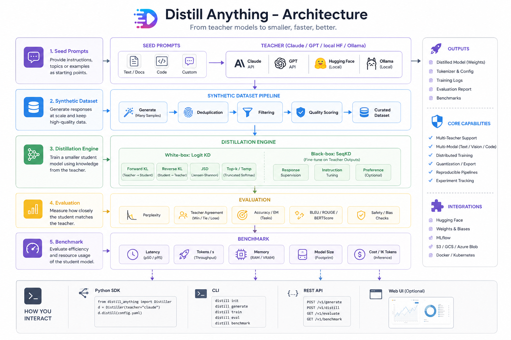

<div align="center"><pre>
  ██████╗ ██╗███████╗████████╗██╗██╗     ██╗
  ██╔══██╗██║██╔════╝╚══██╔══╝██║██║     ██║
  ██║  ██║██║███████╗   ██║   ██║██║     ██║
  ██║  ██║██║╚════██║   ██║   ██║██║     ██║
  ██████╔╝██║███████║   ██║   ██║███████╗███████╗
  ╚═════╝ ╚═╝╚══════╝   ╚═╝   ╚═╝╚══════╝╚══════╝
              A N Y T H I N G
     Distill any model into one you own
</pre></div>

<p align="center"><strong>generate → distill → judge → benchmark · white-box KD + black-box seqKD · any teacher (Claude / GPT / HF / Ollama) · LLM-as-judge report card · runs on a MacBook</strong></p>

<p align="center">
  <a href="https://github.com/AIAnytime/distillanything/actions/workflows/ci.yml"></a>
  <a href="https://www.python.org/"></a>
  <a href="LICENSE"></a>
  <a href="#development"></a>
  <a href="#whats-real-today-vs-the-vision"></a>
  <a href="https://github.com/astral-sh/ruff"></a>
</p>

<p align="center">
  <a href="#get-started-60-seconds">Install</a> ·
  <a href="#proof">Proof</a> ·
  <a href="#the-report-card">Report card</a> ·
  <a href="#teachers">Teachers</a> ·
  <a href="#compared-to">Compared to</a> ·
  <a href="#roadmap">Roadmap</a>
</p>

---

Big models know things. Small models ship. Distill Anything covers the **whole distillation lifecycle** — a teacher generates your dataset, a student trains on its logits or its words, a judge scores the result blind, and a benchmark prices it — with one YAML recipe schema that scales from a 16GB MacBook to a GPU cluster.

<p align="center">
  
  <br/><sub>Live: <code>distill smoke</code> — full logit-KD pipeline, offline, &lt;60s on a MacBook. loss 2.24 → 2.08, PASS.</sub>
</p>

<p align="center">
  
  <br/><sub>The full picture. What's shipped vs planned: <a href="#whats-real-today-vs-the-vision">status table</a>.</sub>
</p>

## What it does

- **Any teacher** — `claude`, `openai:gpt-4o-mini`, `ollama:llama3.2`, or any local `hf:` model, selected by one spec string
- **Synthetic data** — `distill generate` turns seed prompts into a deduped instruction dataset, with self-instruct-style prompt expansion (`--expand 5`)
- **Quality gating** — an LLM judge scores every record 1–10 before training (`--judge claude --min-score 7`)
- **White-box logit KD** — forward KL (Hinton), reverse KL (MiniLLM-style), generalized JSD, temperature scaling, and top-k truncation so 50k-vocab KD fits in laptop memory
- **Black-box seqKD** — no logits needed; fine-tune on what an API teacher wrote
- **LLM-as-judge eval** — blind A/B, position-swapped to kill judge bias → win/tie/lose and one headline number: *quality retention*
- **Report card** — `distill report` writes a shareable `REPORT.md`: quality vs the teacher, p50/p95 latency, tokens/s, memory, $ per 1K tokens
- **Hardware-aware** — CUDA (bf16) → Apple Silicon MPS → CPU, detected automatically

## How it works (30 seconds)

```
 Seed prompts (.txt / .jsonl)
      │
      ▼
 Teacher ──────────── claude · openai:<m> · ollama:<m> · hf:<repo>
      │  generate + expand + dedup + judge-score
      ▼
 Curated dataset (JSONL)
      │
      ▼
 Distillation engine
      ├─ logit KD    teacher logits → KL/JSD on every response token   (hf: teachers)
      └─ seqKD       teacher text   → cross-entropy fine-tune          (any teacher)
      │
      ▼
 Judge (blind A/B, position-swapped)  →  win / tie / lose
      │
      ▼
 REPORT.md — "student keeps X% of teacher quality at 1/Nth the size and cost"
```

One `DistillConfig` YAML describes the whole run; the same recipe format works for a 135M student on a MacBook and a 7B student on an A100.

## Get started (60 seconds)

```bash
# 1 — Install
git clone https://github.com/AIAnytime/distillanything && cd distillanything
pip install -e .                    # core (torch, transformers)
pip install -e ".[anthropic]"       # optional: Claude as teacher/judge
pip install -e ".[openai]"          # optional: OpenAI / vLLM / Ollama teachers

# 2 — Verify your machine (tiny random models, zero downloads, <1 min)
distill smoke

# 3 — First real distillation (SmolLM2-360M → 135M, ~1GB download, runs on MPS)
distill generate examples/data/seed_prompts.txt \
  --teacher hf:HuggingFaceTB/SmolLM2-360M-Instruct --out data/train.jsonl --expand 5
distill train recipes/mac-small.yaml
distill report runs/mac-small --dataset data/train.jsonl \
  --teacher hf:HuggingFaceTB/SmolLM2-360M-Instruct --judge hf:HuggingFaceTB/SmolLM2-360M-Instruct
```

Prefer Claude as the teacher? `export ANTHROPIC_API_KEY=...` then swap `--teacher claude` and `distill train recipes/claude-blackbox.yaml`.

## Proof

We publish only what we've measured. Every number below reproduces on a stock Apple-Silicon MacBook with the commands shown — no cluster required.

**End-to-end pipeline, offline, under a minute** (`distill smoke`):

```
Training mode=logit device=mps steps=30 loss=forward_kl(T=2.0, alpha=0.5)
  step 10/30  loss 2.2371   →   step 30/30  loss 2.0767
PASS: loss 2.237 -> 2.077 over 30 steps
```

**Benchmark output** (`distill benchmark sshleifer/tiny-gpt2 --n-runs 3 --cost-per-hour 1.20`, measured on an M-series MacBook):

| Metric | Value |
|---|---:|
| latency_p50_s | 0.054 |
| latency_p95_s | 0.079 |
| tokens_per_s | 262.4 |
| memory_mb | 0.4 |
| cost_per_1k_tokens_usd | 0.001271 |

**Honest-by-construction evals:** the judge sees answers blind and judges each pair twice with positions swapped — a judge that always prefers "Answer A" nets out to a tie (that exact adversarial case is in the test suite). Disagreements and unparseable verdicts count as ties, never wins. 31 tests run fully offline against tiny random models.

## The report card

The question that matters is *"did the student keep the teacher's quality at a fraction of the cost?"* — so every run can end with a one-page answer:

```bash
distill report runs/mac-small \
  --dataset data/train.jsonl \
  --teacher hf:HuggingFaceTB/SmolLM2-360M-Instruct \
  --judge claude --n 32 --cost-per-hour 1.20
```

`REPORT.md` leads with **quality retention** (how often the student matches or beats the reference), then a side-by-side efficiency table (params, tokens/s, p50/p95, memory, $/1K tokens — "3.0x smaller and 3.0x faster"), sample outputs, and the training metrics. `report.json` sits next to it for machines.

## Teachers

One string selects any knowledge source — as teacher *or* as judge:

| Spec | Backend | KD mode |
|---|---|---|
| `hf:HuggingFaceTB/SmolLM2-360M-Instruct` | local Hugging Face model | white-box (logits) |
| `claude` / `claude:claude-opus-4-8` | Anthropic API | black-box (seqKD) |
| `openai:gpt-4o-mini` | OpenAI API (or any compatible endpoint) | black-box |
| `ollama:llama3.2` | local Ollama server | black-box |

**One rule to know:** logit KD requires student and teacher to share a tokenizer (same model family). Across tokenizers, use `mode: seqkd` — cross-tokenizer logit alignment (ULD) is on the roadmap.

## Recipes

Everything is a YAML recipe (`distill init` writes a starter):

```yaml
mode: logit                # or seqkd
teacher: { spec: hf:HuggingFaceTB/SmolLM2-360M-Instruct }
student: { model: HuggingFaceTB/SmolLM2-135M-Instruct }
data:    { path: data/train.jsonl, max_seq_len: 512 }
loss:    { kind: forward_kl, temperature: 2.0, alpha: 0.5, top_k: 256 }
train:   { output_dir: runs/out, lr: 1.0e-4, epochs: 2, batch_size: 2, grad_accum: 8 }
```

Or skip YAML entirely:

```python
from distillanything import Student

student = Student("HuggingFaceTB/SmolLM2-135M-Instruct")
student.learn(teacher="claude", dataset="data/prompts_only.jsonl")   # generates missing responses, then trains
print(student.generate("Explain what a database index is."))
print(student.benchmark())
```

## When to use · When to skip

**Great fit if you…**
- want a specialized model that's 10–100x smaller than the API model you're calling today
- have (or can seed) a few hundred domain prompts and an API key or a local teacher model
- work on a laptop — everything here is sized to run and iterate on 16GB of RAM

**Skip it if you…**
- need RAG or prompt engineering, not a trained model — distillation is for when the task is stable and volume is high
- need cross-tokenizer logit KD, multimodal, or distributed training *today* (roadmap, not shipped)
- expect a hosted platform — this is a framework; you bring the compute

<a id="whats-real-today-vs-the-vision"></a>
<details>
<summary><b>What's real today vs the vision</b></summary>

The architecture diagram is the north star, not the changelog. Every box, mapped honestly:

**Legend:** ✅ shipped &nbsp;·&nbsp; 🚧 partial &nbsp;·&nbsp; 🗺️ planned, not yet built

| Diagram section | Box | Status | Notes |
|---|---|:---:|---|
| Seed Prompts | Text / Docs, Custom | ✅ | `.txt` (one prompt/line) and `.jsonl` (`prompt`/`messages`/`text`) |
| Seed Prompts | Code | 🚧 | No special handling — treated as plain text, works but untuned |
| Teacher | Claude API, GPT API, Hugging Face (Local), Ollama (Local) | ✅ | `hf:` / `claude` / `openai:` / `ollama:` teacher specs |
| Synthetic Dataset Pipeline | Generate, Deduplication, Curated Dataset | ✅ | `distill generate`, normalized-content dedup |
| Synthetic Dataset Pipeline | Filtering | 🚧 | Empty/too-short response filter only — no content or toxicity filters yet |
| Synthetic Dataset Pipeline | Quality Scoring | ✅ | LLM-judge 1-10 scoring: `distill generate --judge claude --min-score 7` |
| Distillation Engine | Forward KL, Reverse KL, JSD, Top-k/Temp | ✅ | White-box logit KD, all three divergences + top-k truncation |
| Distillation Engine | Response Supervision, Instruction Tuning | ✅ | Black-box seqKD (fine-tune on teacher-generated text) |
| Distillation Engine | Preference (Optional) | 🗺️ | No DPO/preference-based distillation yet |
| Evaluation | Perplexity | ✅ | |
| Evaluation | Teacher Agreement | ✅ | Win/tie/lose via blind, position-swapped LLM judge (`distill report --judge`) + token-level agreement |
| Evaluation | Accuracy/EM, BLEU/ROUGE/BERTScore, Safety/Bias Checks | 🗺️ | No task-benchmark or safety-eval harness yet |
| Benchmark | Tokens/s, Memory, Model Size | ✅ | `distill benchmark` |
| Benchmark | Latency | ✅ | p50/p95 over repeated runs (`--n-runs`) |
| Benchmark | Cost / 1K Tokens | ✅ | From measured throughput × your `--cost-per-hour` |
| Outputs | Model Weights, Tokenizer & Config, Training Logs, Benchmarks | ✅ | Saved to `output_dir` on every run |
| Outputs | Evaluation Report | ✅ | `distill report` writes a shareable REPORT.md + report.json per run |
| Core Capabilities | Reproducible Pipelines | ✅ | Seeded runs + full config snapshot saved alongside the checkpoint |
| Core Capabilities | Multi-Teacher Support, Multi-Modal, Distributed Training, Quantization/Export, Experiment Tracking | 🗺️ | One teacher/one device per run today; text-only; no W&B/MLflow hooks |
| Integrations | Hugging Face | ✅ | Models, tokenizers, chat templates |
| Integrations | Weights & Biases, MLflow, S3/GCS/Azure Blob, Docker/Kubernetes | 🗺️ | Not integrated yet |
| How you interact | Python SDK, CLI | ✅ | `Student().learn(...)` and `distill ...` |
| How you interact | REST API, Web UI | 🗺️ | CLI/SDK only for now |

</details>

<details>
<summary><b>What's inside</b></summary>

- **`teachers/`** — one `Teacher` abstraction; local HF models expose logits (white-box), API teachers expose text (black-box). Registry resolves spec strings.
- **`losses/kd.py`** — masked, temperature-scaled (T² gradient correction) forward KL / reverse KL / generalized JSD, with top-k support truncation and automatic vocab-padding alignment.
- **`data/`** — JSONL/txt loading, chat-template rendering, prompt-masked tokenization, normalized dedup, teacher-driven generation with prompt expansion.
- **`train/trainer.py`** — hand-rolled loop (no HF Trainer): grad accumulation, cosine LR + warmup, grad clipping, KD+CE mixing, MPS-safe autocast policy.
- **`eval/judge.py`** — pairwise blind judging with position-swap debiasing; absolute 1–10 scoring for dataset gating.
- **`eval/benchmark.py`** — p50/p95 latency, throughput, peak memory, $/1K tokens.
- **`eval/report.py`** — REPORT.md + report.json builder.
- **`testing.py`** — tiny random Llama models + in-memory char tokenizer, so the whole suite runs offline.

</details>

## Compared to

Excellent distillation *trainers* exist — the gap this project fills is the **lifecycle around the training loop**:

|  | Primary focus | Data generation from API teachers | Blind LLM-judge → report card | Sized for laptops |
|---|---|:---:|:---:|:---:|
| **Distill Anything** | Full lifecycle: generate → distill → judge → benchmark | ✅ | ✅ | ✅ |
| [TRL](https://github.com/huggingface/trl) (GKD) | RL/KD training methods in the HF ecosystem | — | — | GPU-oriented |
| [DistillKit](https://github.com/arcee-ai/DistillKit) | KD training techniques | — | — | GPU-oriented |
| [EasyDistill](https://github.com/modelscope/easydistill) | KD training + data synthesis toolkit | ✅ | — | GPU-oriented |

If you already have a curated dataset and a GPU and just want a training loop, TRL's GKD trainer is great — and our loss implementations follow the same literature (Hinton KD, MiniLLM, DistiLLM).

## Roadmap

Beyond closing the 🗺️ gaps in the status table:

- [ ] **LoRA/QLoRA students** — distill into 1–3B students on 16GB of RAM *(next up)*
- [ ] Hidden-state / feature KD with learned projectors
- [ ] Cross-tokenizer logit distillation (ULD)
- [ ] Multi-teacher voting and ensembling
- [ ] VLM, embedding, and reranker distillation
- [ ] Eval harness integration (lm-eval-harness) and regression tracking

Everything in this repo is and stays Apache-2.0. A hosted layer (GPU orchestration, dashboards, model registry) may come later — the framework is the product, not the funnel.

## Development

```bash
uv venv && uv pip install -e ".[dev]"
pytest            # 31 tests, fully offline (tiny random models, fake judges)
distill smoke     # end-to-end pipeline check on your hardware
```

PRs welcome — the test suite needs no GPU, no API keys, and no downloads.

## License

Apache 2.0 — see [LICENSE](LICENSE).
